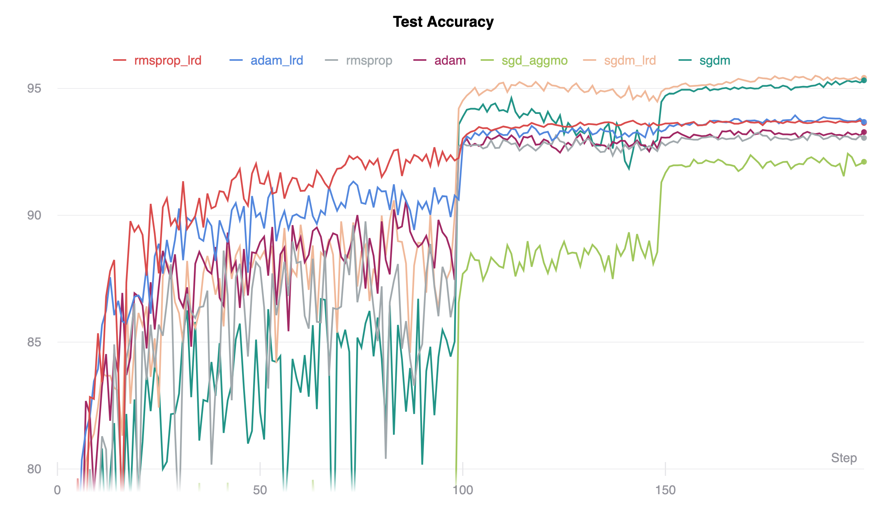

Benchmark Suite for Stochastic Gradient Descent Optimization Algorithms in Pytorch
-----

This repository contains code to benchmark novel stochastic gradient descent algorithms on the [CIFAR10](https://www.cs.toronto.edu/~kriz/cifar.html) dataset.

If you want your algorithm to be included open an issue here.

Requirements: Python 3.6+, Pytorch 1.3+, tqdm

Supported optimizers:

1. Stochastic Gradient Descent with Momentum (SGDM)
2. Stochastic Gradient Descent with Aggregated Momentum (SGD_aggmo) [[arXiv]](https://arxiv.org/abs/1804.00325)
3. Stochastic Gradient Descent with Momentum and Learning Rate Dropout (SGD_LRD) [[arXiv]](https://arxiv.org/pdf/1912.00144.pdf)
4. Adam: A method for stochastic optimization (ADAM) [[arXiv]](https://arxiv.org/abs/1412.6980)
5. Adam with Learning Rate Dropout (ADAM_LRD) [[arXiv]](https://arxiv.org/pdf/1912.00144.pdf)
6. RMSProp [[Lecture Notes]](https://www.cs.toronto.edu/~tijmen/csc321/slides/lecture_slides_lec6.pdf)
7. RMSProp with Learning Rate Dropout [[arXiv]](https://arxiv.org/pdf/1912.00144.pdf)
8. RAdam: On the Variance of the Adaptive Learning Rate and Beyond [[arXiv]](https://arxiv.org/abs/1908.03265)
9. RAdam with Learning Rate Dropout [[arXiv]](https://arxiv.org/pdf/1912.00144.pdf)
10. AdaBound: Adaptive Gradient Methods with Dynamic Bound of Learning Rate [[ICLR2019]](https://openreview.net/pdf?id=Bkg3g2R9FX) 

Results:
------

More details are of all runs can be found [here](https://app.wandb.ai/ifeherva/optimizer-evaluation).
